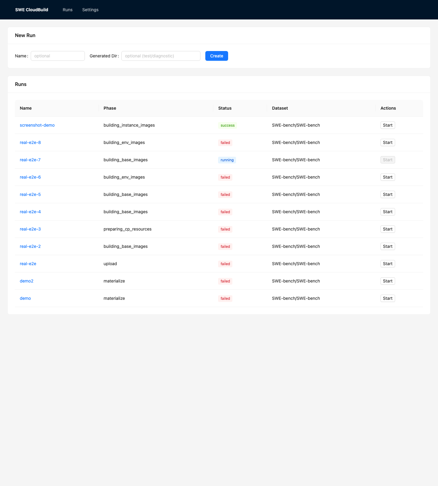
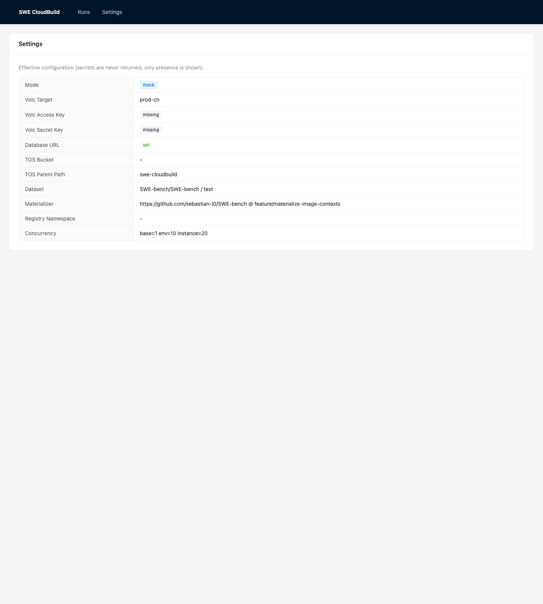
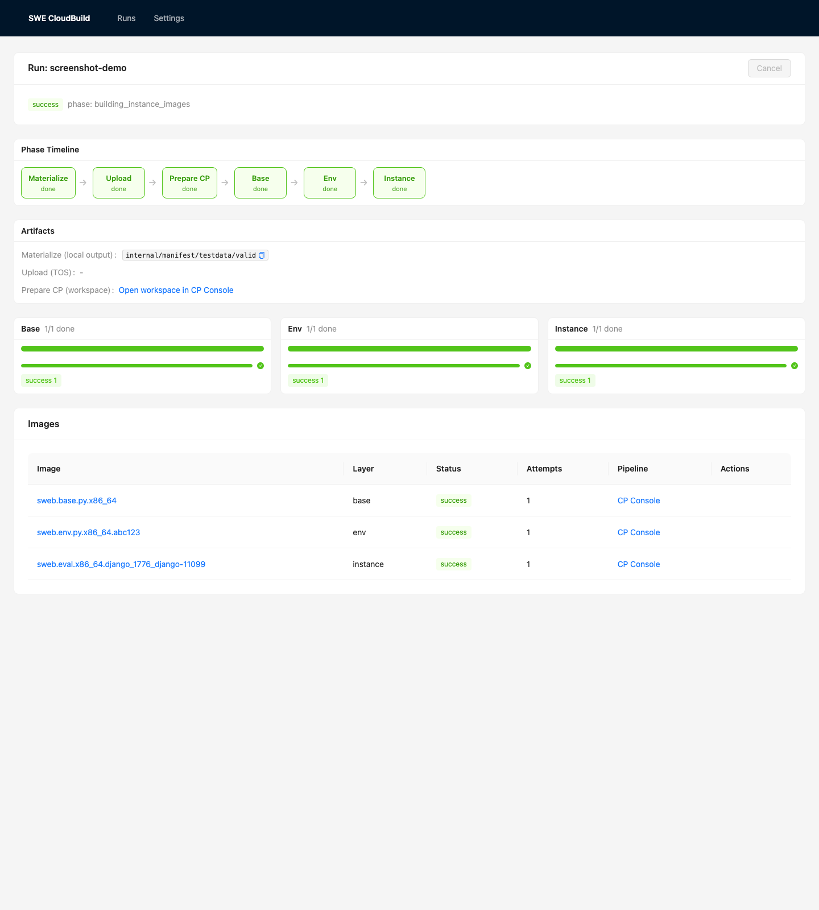
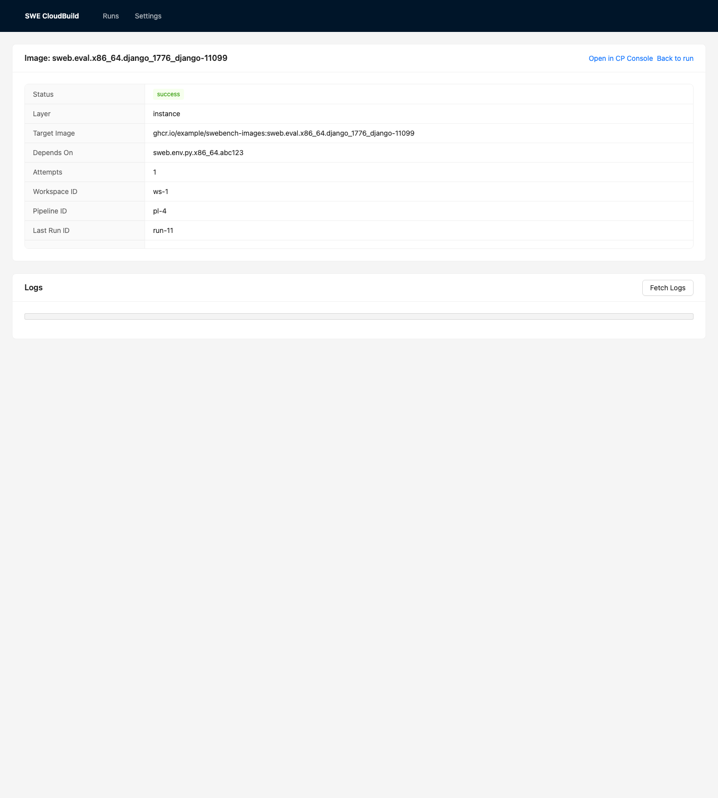

# SWE CloudBuild

Local web application for building SWE-bench Docker images through Volcengine cloud services.

## Product screenshots

### Runs



### Settings



### Run detail



### Image detail



## Foundation quickstart

1. Copy `.env.example` to `.env` and fill local values as needed.
2. Start PostgreSQL:
   ```bash
   docker compose up -d postgres
   ```
3. Run the backend:
   ```bash
   cd server
   go run ./cmd/server
   ```
4. Run the frontend after installing JS dependencies:
   ```bash
   cd web
   npm install
   npm run dev
   ```

The first runnable demo targets mock mode by default and uses PostgreSQL from `arm64v8/postgres:15`.

## Mock end-to-end quickstart

Mock mode requires no Volcengine credentials or TOS: the CP client is in-memory
and uploads are skipped.

1. Set `SWE_CLOUDBUILD_MOCK=1` (the default in `.env.example`).
2. Start PostgreSQL and the backend as above.
3. Create and start a run from a pre-generated context directory (a tiny fixture
   ships at `server/internal/manifest/testdata/valid`):
   ```bash
   RUN=$(curl -s -XPOST localhost:8080/api/runs \
     -d '{"name":"demo","outputDir":"internal/manifest/testdata/valid"}' | jq -r .ID)
   curl -s -XPOST localhost:8080/api/runs/$RUN/start
   curl -s localhost:8080/api/runs/$RUN | jq '.run.Status, .summary'
   ```
4. The run progresses base -> env -> instance under the strict gate and reaches
   `success`. Image logs are available at `/api/images/:id/log`.

The same flow is covered automatically by the backend test
`TestCreateAndRunEndToEndMock`.

## Live run runbook (Volcengine CP)

For a real build the backend materializes Dockerfile contexts, uploads them to
TOS, and drives Volcengine Continuous Delivery (CP). Set `SWE_CLOUDBUILD_MOCK=0`
and provide:

- `VOLC_ACCESS_KEY` / `VOLC_SECRET_KEY` — Volcengine credentials (never committed).
- `SWE_CLOUDBUILD_VOLC_TARGET` — `prod-cn` (default), `prod-sg`, `byteplus-sg`,
  `pre`, or `prod` (alias of `prod-cn`).
- `SWE_CLOUDBUILD_TOS_BUCKET` / `SWE_CLOUDBUILD_TOS_PREFIX` / `SWE_CLOUDBUILD_TOS_REGION`
  — TOS upload target and region used to build the public context download URL.
- Target registry (the CP build step pushes here):
  - `SWE_CLOUDBUILD_REGISTRY_INSTANCE` — registry domain used in the context
    download URL, e.g. `<instance>-<region>.cr.volces.com`.
  - `SWE_CLOUDBUILD_REGISTRY_INSTANCE_NAME` — CR instance name used by the build
    step, e.g. `<instance>`.
  - `SWE_CLOUDBUILD_REGISTRY_NS` / `SWE_CLOUDBUILD_REGISTRY_REPO` — namespace and repo.

The backend creates CP resources via the API (no manual pre-creation): one
workspace per run plus base/env/instance pipelines. The materializer branch is
`sebastian-l0/SWE-bench@feature/materialize-image-contexts`.

### Generated-directory input (fastest path validated end-to-end)

You can skip the in-backend materialize/upload and feed a pre-generated context
directory. This was used to validate a real base→env→instance run:

1. Materialize contexts with the SWE-bench fork (writes `manifest.json` and
   `contexts/{base,env,instances}/...`):
   ```bash
   python -m swebench.harness.materialize_images \
     --dataset_name princeton-nlp/SWE-bench_Lite --split test \
     --instance_ids <id> \
     --image_prefix <registry-domain>/<ns>/<repo> --tag latest \
     --output_dir /tmp/swe-out --arch x86_64
   ```
2. Upload the contexts to TOS with public-read so the CP build step can fetch
   them (`tosutil` from the Volcengine docs; configure credentials separately,
   never in the repo):
   ```bash
   tosutil cp -r /tmp/swe-out/contexts \
     tos://<bucket>/<prefix>/<timestamp>/ -acl=public-read
   ```
3. Point the backend at that prefix via `SWE_CLOUDBUILD_TOS_PREFIX=<prefix>/<timestamp>/contexts`,
   then create a run with `outputDir=/tmp/swe-out` and start it. Generated-directory
   input skips the in-backend upload and builds directly from the uploaded contexts.

### Verified CP API contract

The CP client was validated against the production CP API:

- Service `cp`, API version `2023-05-01` (override with `VOLC_CP_SERVICE` /
  `VOLC_CP_VERSION`; endpoint/region with `VOLC_CP_ENDPOINT` / `VOLC_CP_REGION`).
- `CreateWorkspace` requires `Visibility` (value `Account`).
- `RunPipeline` identifies the pipeline via `Id`, requires `WorkspaceId`, and
  overrides dynamic parameters via the `Parameters` field (parameters must have a
  non-empty default at create time for the override to take effect).
- Run status is read through `ListPipelineRuns` (no single-run GET); it returns
  nested `Stages[].Tasks[]`.
- `CancelPipelineRun` requires `WorkspaceId` and `PipelineId`.
- `GetTaskRunLog` requires `WorkspaceId`, `PipelineId`, `PipelineRunId`,
  `TaskRunId`, `TaskId` and `StepName`, returning `LogLines`.
- The build step's `registryInstance` is the CR instance name, while the context
  download URL uses the registry domain — these are configured separately.
- The per-image `tag` is derived from the image's target reference (the
  materializer sanitizes `__` to `_1776_`), and the instance layer maps to the
  plural `instances` context directory.

Secrets are never returned by the API (only presence is reported) and are
redacted from logs, events and command output.
